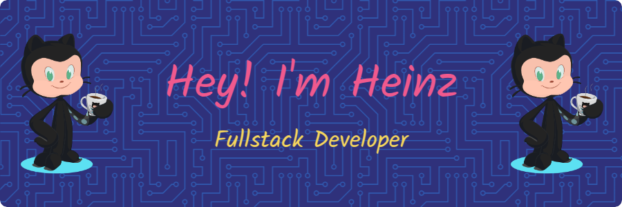

## 💫 About Me
👋 Hi there! I'm a student at **Universitas Nahdlatul Ulama Al Ghazali**, majoring in **Informatics**.   💻 I have a strong passion for **web development**, exploring new technologies, and building interactive applications.   📍 I'm from **Banyumas**, Central Java, Indonesia.   📚 Always eager to improve my skills and contribute to open-source projects!

 
 
 
 

## 💻 Tech Stack
 
 
 
 
 
 
 
 
 
 
 
 
 

 
 
 
 
 
 
 
 
 
 
 
 
 
 
 
 
 
 
 
 
 
 
 
 
 
 
 
 
 
 
 
 
 
 
 
 
 
 
 
 
 
 
 
 
 
 
 
 
 
 
 

## ✍️ Random Dev Quote

## 📊 GitHub Stats:

<!--  -->

<picture>
  <source media="(prefers-color-scheme: dark)" srcset="https://raw.githubusercontent.com/demonicheinz/demonicheinz/output/github-snake-dark.svg" />
  <source media="(prefers-color-scheme: light)" srcset="https://raw.githubusercontent.com/demonicheinz/demonicheinz/output/github-snake.svg" />
  
</picture>

